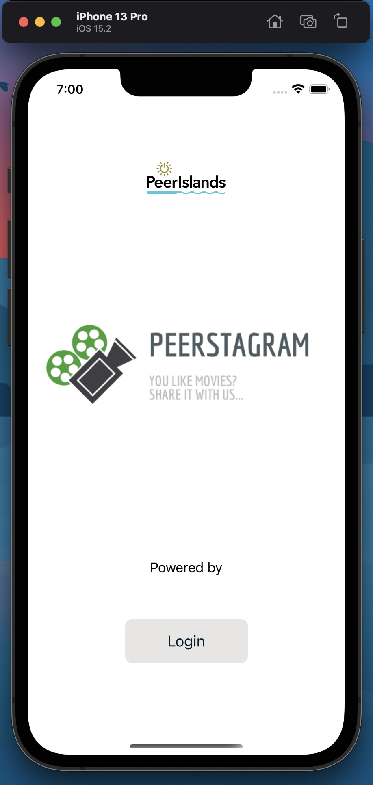

# Sentiment analysis using MongoDB Atlas, Realm and Bidirectional Encoder Representations from Transformers

This document will be a walkthrough to run the BERT model.

## Pre-requisites
To install all the requirements I highly advise using a conda environment. You can download miniconda or anaconda to maintain environments in python.

```
conda create -n <environment-name> --file ./env/requirements.txt
```

Activate environment
```
conda activate <environment-name>
```

## To test the Sentiment model
You can use the `test-model.py` python file. You can change the example array with any string you like.\
> Sentiment = [0 - 4] where 0 is negative, 2 is neutral and 4 is positive


## Login for MongoDB cluster
In order to access change streams to the Movie collection for sentiment analysis please do ask me for the login details for testing.

## Running watcher and sentiment analysis

The model is already trained and saved as shown in main.ipynb. All you have to do is run `change-watcher.py`.

```
python ./change-watcher.py
```
This will listen to the changes in MongoDB collection "Movies". When the ios application syncs its Realm database to the UserModel and Movies collection the change-watcher will run and replace the Movies document with the appropriate Sentiment score.

## BERT Model

```
Model: "model"
__________________________________________________________________________________________________
 Layer (type)                   Output Shape         Param #     Connected to                     
==================================================================================================
 text (InputLayer)              [(None,)]            0           []                               
                                                                                                  
 preprocessing (KerasLayer)     {'input_type_ids':   0           ['text[0][0]']                   
                                (None, 128),                                                      
                                 'input_mask': (Non                                               
                                e, 128),                                                          
                                 'input_word_ids':                                                
                                (None, 128)}                                                      
                                                                                                  
 BERT_encoder (KerasLayer)      {'sequence_output':  28763649    ['preprocessing[0][0]',          
                                 (None, 128, 512),                'preprocessing[0][1]',          
                                 'pooled_output': (               'preprocessing[0][2]']          
                                None, 512),                                                       
                                 'encoder_outputs':                                               
                                 [(None, 128, 512),                                               
                                 (None, 128, 512),                                                
                                 (None, 128, 512),                                                
                                 (None, 128, 512)],                                               
                                 'default': (None,                                                
                                512)}                                                             
                                                                                                  
==================================================================================================
Total params: 28,763,649
Trainable params: 0
Non-trainable params: 28,763,649
__________________________________________________________________________________________________
```

## EDGE Model
```
_________________________________________________________________
 Layer (type)                Output Shape              Param #   
=================================================================
 feature_input (InputLayer)  [(None, 512)]             0         
                                                                 
 fc1 (Dense)                 (None, 64)                32832     
                                                                 
 fc1-prelu (PReLU)           (None, 64)                64        
                                                                 
 fc2 (Dense)                 (None, 32)                2080      
                                                                 
 fc2-prelu (PReLU)           (None, 32)                32        
                                                                 
 classifier (Dense)          (None, 1)                 33        
                                                                 
=================================================================
Total params: 35,041
Trainable params: 35,041
Non-trainable params: 0
_________________________________________________________________
```

## Combined Model

```
_________________________________________________________________
 Layer (type)                Output Shape              Param #   
=================================================================
 text_input (InputLayer)     [(None,)]                 0         
                                                                 
 model (Functional)          (None, 512)               28763649  
                                                                 
 model_1 (Functional)        (None, 1)                 35041     
                                                                 
=================================================================
Total params: 28,798,690
Trainable params: 35,041
Non-trainable params: 28,763,649
_________________________________________________________________
```

## Training time 

Laptop spec:
- AMD Ryzen 7
- RTX 3060 6Gb
- 16GB Ram

```
Training model with https://tfhub.dev/tensorflow/small_bert/bert_en_uncased_L-4_H-512_A-8/1
Epoch 1/3
26215/26215 [==============================] - 3595s 137ms/step - loss: 2.4305 - mean_squared_error: 2.3700 - val_loss: 2.3037 - val_mean_squared_error: 2.2450
Epoch 2/3
26215/26215 [==============================] - 3555s 136ms/step - loss: 2.2559 - mean_squared_error: 2.1983 - val_loss: 2.2507 - val_mean_squared_error: 2.1938
Epoch 3/3
26215/26215 [==============================] - 3548s 135ms/step - loss: 2.2297 - mean_squared_error: 2.1732 - val_loss: 2.2410 - val_mean_squared_error: 2.1846
```

## Atlas Cluster
### Dataset to train BERT + EDGE Model


## Some examples of sentiment scores

> Sentiment = [0 - 4] where 0 is negative, 2 is neutral and 4 is positive
```
Results from the saved model:
'this is such an amazing movie!' : 3.3369038 
'The movie was great!' : 1.71035 
'The movie was meh.' : 0.9247804
'The movie was okish.' : 0.73089343
'The movie was terrible...' : 0.18032452
 ```

 ## iOS Application

The iOS app is very simple and is only a place holder. This app can be substituted with any application that can collect user data for sentiment analysis.

 ### Home Screen
 

 ### Login
 

 ### Movie Review
 

 ### Realm Sync

 Realm Sync works both ways. If there is a change in the local DB it will be synced with cloud DB, and if there is a change in the cloud DB it will be synched in the local DB

 Here is an example of how local DB is updated with the Sentiment Score given by our sentiment analysis change stream which is on the cloud.

 #### Local DB
 

 #### Local DB with Atlas side by side
 
